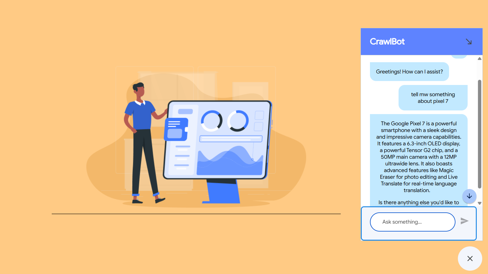

# QnA Chatbot
This repository houses a sample Question-and-Answer (QnA) Chatbot designed to dynamically retrieve information from the website. By employing web crawling techniques, this chatbot can understand user queries, fetch relevant content from your indexed websites, and synthesize precise answers. This project aims to demonstrate QnA bot that uses a public website deployed by Google.

## ✨ Features
* Real-time Information Retrieval: The chatbot doesn't rely on a static, pre-indexed knowledge base. Instead, it actively crawls and searches the web to fetch the most current and relevant information in response to a user's query.
* Intelligent Query Processing (NLP): It can understand natural language questions from users, interpret their intent, and translate that intent into effective search queries and crawling strategies.
* Dynamic Content Extraction & Parsing: Beyond just fetching web pages, the chatbot is equipped to parse diverse HTML structures, identify relevant text, and extract specific data points from the crawled content, even from semi-structured or unstructured sources.
* Scalable and Efficient Crawling: It employs strategies like asynchronous requests, polite crawling (respecting robots.txt and rate limits), and potentially distributed crawling to efficiently gather information from a large number of web pages without overwhelming target servers. 

